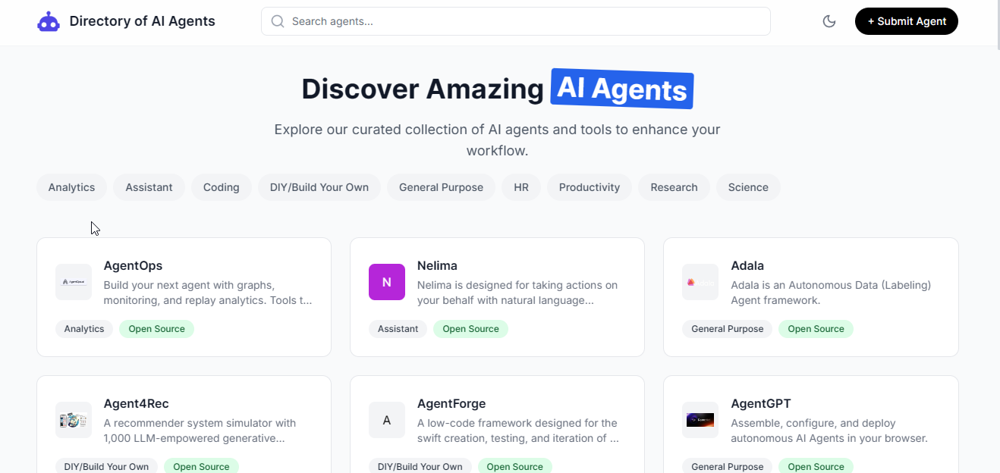
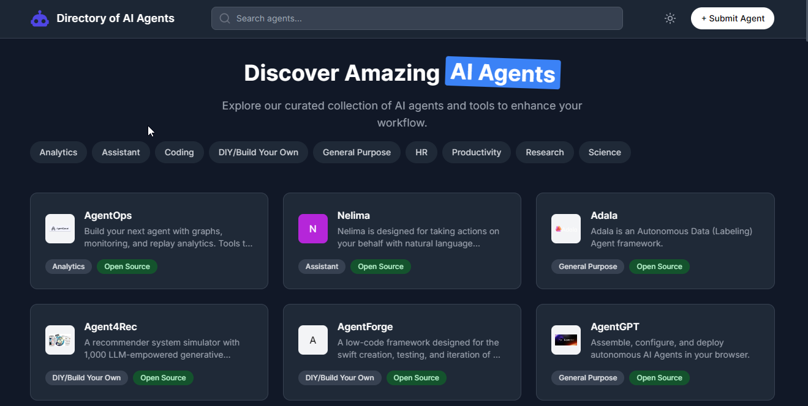
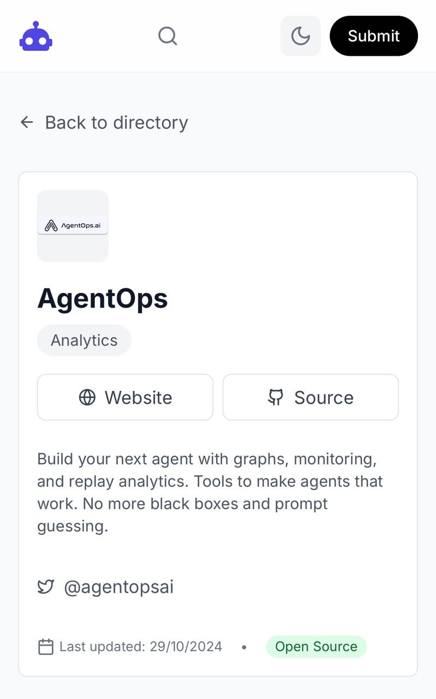

# Directory Boilerplate Kit

A modern, responsive, and customizable directory website boilerplate built with React, TypeScript, and Tailwind CSS. Perfect for creating searchable directories from structured data sources.

## Features

- 🎨 Modern UI with Light/Dark mode support
- 📱 Fully responsive design (mobile-first approach)
- 🔍 Real-time search functionality
- 🏷️ Category-based filtering
- 🎯 SEO-friendly structure
- 🚀 Fast performance
- 💅 Customizable styling with Tailwind CSS
- 📊 Easy data integration
- 🔄 Automatic logo generation for entries without logos
- 🎭 Consistent theming across components

## Tech Stack

- React 18
- TypeScript
- Tailwind CSS
- Vite
- React Router
- Lucide Icons

## Getting Started

### Prerequisites

- Node.js 16.x or later
- npm or yarn
- Git

### Installation

1. Clone the repository:

git clone https://github.com/yourusername/directory-boilerplate.git
cd directory-boilerplate

2. Install dependencies:

npm install
# or
yarn install

3. Set up configuration files:

Create tailwind.config.js:

/** @type {import('tailwindcss').Config} */
export default {
  content: [
    "./index.html",
    "./src/**/*.{js,ts,jsx,tsx}",
  ],
  darkMode: 'class',
  theme: {
    extend: {},
  },
  plugins: [],
}

Create postcss.config.js:

export default {
  plugins: {
    tailwindcss: {},
    autoprefixer: {},
  },
}

Create tsconfig.json:

{
  "compilerOptions": {
    "target": "ES2020",
    "useDefineForClassFields": true,
    "lib": ["ES2020", "DOM", "DOM.Iterable"],
    "module": "ESNext",
    "skipLibCheck": true,
    "moduleResolution": "bundler",
    "allowImportingTsExtensions": true,
    "resolveJsonModule": true,
    "isolatedModules": true,
    "noEmit": true,
    "jsx": "react-jsx",
    "strict": true,
    "noUnusedLocals": true,
    "noUnusedParameters": true,
    "noFallthroughCasesInSwitch": true
  },
  "include": ["src"],
  "references": [{ "path": "./tsconfig.node.json" }]
}

Create vite.config.ts:

import { defineConfig } from 'vite'
import react from '@vitejs/plugin-react'

export default defineConfig({
  plugins: [react()],
})

4. Create required directories:

mkdir -p src/{components,pages,data}
mkdir -p public
mkdir -p docs/assets/images

5. Add the source files:
- Copy the provided components to src/components/
- Copy the pages to src/pages/
- Add your data to src/data/agents.ts
- Copy the SVG icon to public/tools.svg
- Add the CSS file to src/index.css

6. Start the development server:

npm run dev
# or
yarn dev

The application will be available at http://localhost:5173

7. For production build:

npm run build
# or
yarn build

The build output will be in the dist directory.

## Data Integration

### Step 1: Prepare Your Data
Convert your data source (CSV, JSON, Excel) into a markdown file format. Example structure:

# Directory Entries

## Entry 1
- Name: Example Name
- Category: Example Category
- Description: Example Description
- Website: https://example.com
- Logo: https://example.com/logo.png

## Entry 2
...

### Step 2: Add Data
1. Place your markdown file in the /src/data/ directory
2. Use AI assistance to convert the markdown data into the required TypeScript format in src/data/agents.ts

### Step 3: Customize
Modify UI elements and styling according to your needs by editing the components in /src/components/.

## Project Structure

├── public/
│   └── tools.svg
├── src/
│   ├── components/
│   │   ├── AgentCard.tsx
│   │   ├── Header.tsx
│   │   └── CategoryFilter.tsx
│   ├── data/
│   │   └── agents.ts
│   ├── pages/
│   │   ├── HomePage.tsx
│   │   └── AgentDetailPage.tsx
│   └── index.css
└── package.json

## Customization

### Styling
- Modify tailwind.config.js for theme customization
- Edit src/index.css for global styles
- Component-specific styling can be found in respective component files

### Components
- Header.tsx: Navigation and search functionality
- AgentCard.tsx: Directory entry card layout
- CategoryFilter.tsx: Category filtering system
- HomePage.tsx: Main directory listing
- AgentDetailPage.tsx: Detailed view of entries

## Features in Detail

### Search Functionality
- Real-time search across all entry fields
- Debounced search for performance
- Highlights matching results

### Category System
- Dynamic category generation from data
- Multiple category support per entry
- Filterable interface

### Responsive Design
- Mobile-first approach
- Adaptive layouts
- Touch-friendly interfaces

### Dark Mode
- System preference detection
- Manual toggle option
- Persistent preference storage

## Performance

The boilerplate is optimized for:
- Fast initial load time
- Smooth animations
- Efficient data handling
- Minimal bundle size

## Browser Support

- Chrome (latest)
- Firefox (latest)
- Safari (latest)
- Edge (latest)

## Contributing

Contributions are welcome! Please feel free to submit a Pull Request.

## License

MIT License

Copyright (c) 2024 [Dambrubaba]

Permission is hereby granted, free of charge, to any person obtaining a copy
of this software and associated documentation files (the "Software"), to deal
in the Software without restriction, including without limitation the rights
to use, copy, modify, merge, publish, distribute, sublicense, and/or sell
copies of the Software, and to permit persons to whom the Software is
furnished to do so, subject to the following conditions:

The above copyright notice and this permission notice shall be included in all
copies or substantial portions of the Software.

THE SOFTWARE IS PROVIDED "AS IS", WITHOUT WARRANTY OF ANY KIND, EXPRESS OR
IMPLIED, INCLUDING BUT NOT LIMITED TO THE WARRANTIES OF MERCHANTABILITY,
FITNESS FOR A PARTICULAR PURPOSE AND NONINFRINGEMENT. IN NO EVENT SHALL THE
AUTHORS OR COPYRIGHT HOLDERS BE LIABLE FOR ANY CLAIM, DAMAGES OR OTHER
LIABILITY, WHETHER IN AN ACTION OF CONTRACT, TORT OR OTHERWISE, ARISING FROM,
OUT OF OR IN CONNECTION WITH THE SOFTWARE OR THE USE OR OTHER DEALINGS IN THE
SOFTWARE.

## Support

For support, please open an issue in the GitHub repository.

## Acknowledgments

- Icons by Lucide Icons (https://lucide.dev/)
- UI inspiration from various modern directory websites 